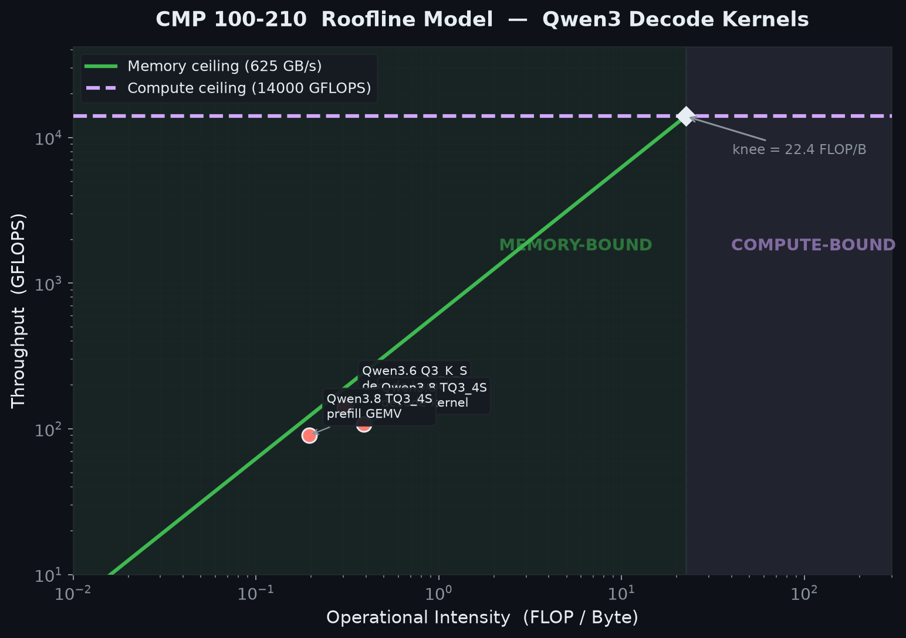
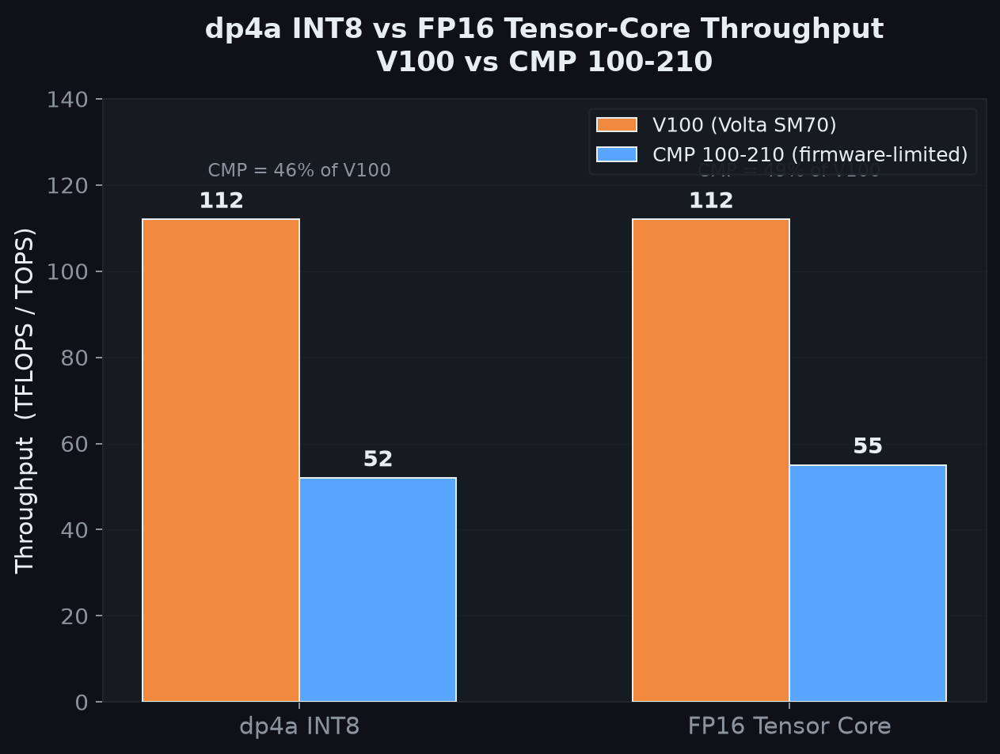

# SuperL8


**DP4A FlashAttention-2 and GEMM for Volta GPUs.**

SuperL8 is a collection of hand-written DP4A FlashAttention-2 and GEMM kernels that exploit a quirk of NVIDIA hardware: on Volta GPUs where tensor cores are disabled or slow, integer `__dp4a` on CUDA cores is **6.7x faster**. If you're running inference on a CMP 100-210, a V100 with disabled tensor cores, or any sm_70 card where fp16 throughput is disappointing — this is the math library that makes it fast.

## The hardware insight

| Math Path | Real V100 | CMP 100-210 |
| --- | --: | --: |
| FP16 tensor core (HMMA) | ~112 TFLOP/s | 6.9 TFLOP/s |
| INT8 `__dp4a` (CUDA core) | ~63 TOP/s | **46 TOP/s** |

On a CMP 100-210, `__dp4a` is the only fast INT8 matmul primitive. IMMA (INT8 tensor cores) doesn't exist until Turing. SuperL8 builds an entire inference stack on top of this instruction — attention, linear layers, quantization, and a custom weight format designed for zero-copy loading.

## What's implemented

### Attention kernels

| Kernel | Direction | Details |
|---|---|---|
| `attn_int8_fwd` | Forward | W8A8 DP4A FlashAttention-2. Causal, GQA/MQA, head dims 32/64/128/256. |
| `attn_w8a8_fwd` | Forward | W8A8 with per-warp quantization. Outlier-aware. |
| `attn_fp16_fwd` | Forward | FP16 reference path (Volta-native HMMA). |
| `attn_bwd` | Backward | Gradient-checked backward pass. Full fp16 state. |
| `attn_decode` | Decode | Split-KV decode with int8 KV cache. 4 variants: fp16 V, int8 V, int4-NF4 V, verify mask. |
| `attn_paged_decode` | Decode | Paged KV cache decode (k8v3 format). |
| `attn_paged_decode_k8v3` | Decode | K8V3 paged decode with int4 V. |
| `attn_varlen_fwd` | Prefill | Variable-length prefill (ragged/non-tile-multiple shapes). |
| `attn_tree_fwd` | Verify | Tree-structured speculative decode verification. |

### GEMM kernels

| Kernel | Details |
|---|---|
| `gemm_dp4a` | W8A8 DP4A GEMM. XOR bank-swizzle. Column-major and row-major. |
| `gemm_decode_dp4a` | Decode-optimized GEMM (batch=1). |
| `gemm_grouped_dp4a` | Grouped GEMM for MoE (all active experts in one launch). |
| `gemm_q4k_dp4a` | Q4_K GGUF decode fused kernel. |
| `gemm_tq34s_dp4a` | TQ3_4S decode fused kernel. |
| `gemm_iq{1s,2s,2xs,2xxs,3s,3xxs,4xs}_dp4a` | 7 IQ-type GGUF decode fused kernels. |

### Hybrid linear attention

| Kernel | Model family |
|---|---|
| `deltanet_chunk` / `deltanet_decode` | Gated-DeltaNet (Qwen3-Next/3.5/3.6) |
| `lightning_attn` | Lightning (MiniMax-Text) |
| `mla_attn` / `mla_attn_fp16` / `mla_attn_int8` | MLA (DeepSeek-V2/V3/V4) |

### Supporting kernels

| Kernel | Purpose |
|---|---|
| `quant_rowwise` | Symmetric per-row int8 quantization. |
| `rmsnorm` | RMSNorm (vec2 half2 vectorized). |
| `rope` | Rotary position embedding. |
| `act_and_mul` | SiLU/GELU activation + elementwise multiply. |
| `causal_conv1d_decode` | Causal conv1d for hybrid architectures. |
| `gated_rmsnorm_decode` | Gated RMSNorm for DeltaNet. |
| `dit_block` | Fused DiT transformer block (attention + MLP). |
| `gather_q3k` | Gather Q for K3 quantization. |

### Quantization

| Component | Details |
|---|---|
| Per-row int8 | Symmetric, K-smoothing, Q outlier detection. |
| V per-channel / per-token | Configurable KV cache quantization. |
| Hadamard rotation | Incoherence rotation for outlier-heavy activations. |
| Lloyd-Max 3-bit | Codebook KV quantizer (qengine-adapted). |
| W3A8 bitplane pack | NF4 codebook, lowbit pack/unpack. |
| IQ reference dequantizers | IQ1_S, IQ2_S, IQ2_XS, IQ2_XXS, IQ3_S, IQ3_XXS, IQ4_XS. |
| TQ3_4S reference | TQ3_4S dequantizer. |

### Weight format

| Feature | Details |
|---|---|
| `.superl8` container | Shard index, CRC validation, mmap zero-copy load. |
| GGUF loader | Native-fused Q2_K–Q6_K and IQ types. Requant-i8 fallback. |

### Infrastructure

| Component | Details |
|---|---|
| Transport compression | PCIe 1.0 x1 codec (int8/int4/NF4 + Hadamard rotation). |
| N-gram draft store | Speculative decode chain-tree mask builder. |
| Autograd | `torch.autograd.Function` for differentiable int8 attention. |
| CPU fallbacks | Pure-torch implementations for all ops when CUDA unavailable. |

## Quick start

```bash
pip install https://github.com/jajmangold/superl8/releases/download/v0.1.0/superl8-0.1.0-cp312-cp312-linux_x86_64.whl
```

```python
import torch
import superl8

q = torch.randn(1, 32, 4096, 128, device="cuda", dtype=torch.float16)
k = torch.randn(1,  8, 4096, 128, device="cuda", dtype=torch.float16)
v = torch.randn(1,  8, 4096, 128, device="cuda", dtype=torch.float16)

# INT8 FlashAttention-2 forward (quantizes internally)
out = superl8.attn_int8_fwd(q, k, v, causal=True)
```

Requires Python 3.12, CUDA 12.9, and a Volta-capable GPU (sm_70).

## Performance

Tested on a CMP 100-210 (V100-labelled fleet card):

| Model | Metric | Value |
|---|---|---|
| Qwen3.6-27B Q3_K_S | Steady decode | 21.3 tok/s |
| Qwen3.6-27B Q3_K_S | End-to-end | 7.2 tok/s |
| Qwen3.6-27B Q3_K_S | Peak VRAM | 14.3 GiB |

See `bench/qwen3-scoreboard.json` for the full provenance-locked benchmark data.

### Roofline analysis



### dp4a vs FP16 tensor cores



## Design

See [docs/DESIGN.md](docs/DESIGN.md) for architecture decisions, quantization strategy, alternatives considered, and performance characteristics.

## Roadmap

Performance improvements planned for upcoming releases:

- **O(N) memory-efficient backward** — current backward stores full attention matrices. Tiling to O(1) memory will unlock longer contexts and training on memory-constrained cards.
- **Multi-token prediction (MTP) verification fusion** — fuse the MTP draft-verify step into a single kernel launch to eliminate the host round-trip.
- **Paged KV cache v2** — variable block sizes and eviction policies for prefix caching.
- **W4A8 GEMM decode** — 4-bit weight decode GEMM to halve weight bandwidth vs W8A8.
- **Compile-time kernel selection** — auto-tune tile sizes and split factors per GPU at install time instead of runtime dispatch.
- **FP8 fallback path** — for Hopper/Ada cards where FP8 tensor cores exist, provide a fast fallback instead of the INT8 CUDA core path.
- **Persistent kernel launch** — keep the GPU context alive across calls to eliminate launch overhead on repeated prefill/decode cycles.

## Build from source

```bash
git clone https://github.com/jajmangold/superl8.git
cd superl8
pip install -e ".[dev]"
```

## Tests

```bash
pytest tests/ -ra
```

## Related repos

- [**SuperL8 Serve**](https://github.com/jajmangold/superl8-serve) — OpenAI-compatible inference server built on SuperL8. Continuous batching, CUDA graphs, paged KV cache, speculative decode.
- [**ComfyUI-SuperL8**](https://github.com/jajmangold/ComfyUI-superl8) — ComfyUI nodes for INT8 quantized diffusion DiTs. SQNR accuracy gating, GGUF loading, multi-GPU.

## License

BSD-3-Clause. See [LICENSE](LICENSE).

Quantization approach informed by SDNQ and SageAttention. The 3-bit Lloyd-Max KV quantizer and transport bridge are informed by [qengine](https://github.com/Haru-neo/qengine) (Apache-2.0).
